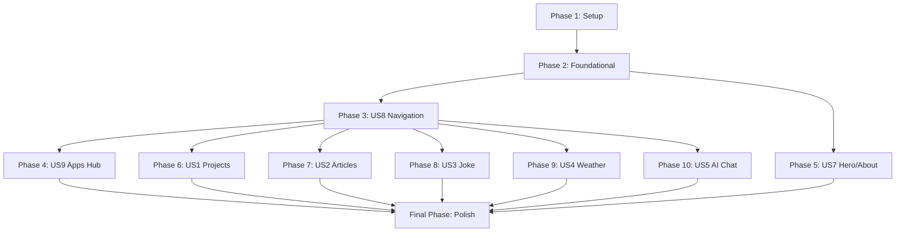

# Implementation Tasks: ReactSparkPortfolio Migration

**Feature**: ReactSparkPortfolio Migration to TailwindSpark  
**Branch**: `003-reactspark-migration`  
**Date**: March 2, 2026  
**Planning Docs**: [spec.md](spec.md) | [plan.md](plan.md) | [research.md](research.md) | [data-model.md](data-model.md) | [quickstart.md](quickstart.md)

---

## Task Organization

Tasks are organized by **user story** to enable independent implementation and testing. Each phase represents a complete, independently testable increment.

**Task Format**: `- [ ] [TaskID] [P?] [Story Label] Description with file path`
- **TaskID**: Sequential number (T001, T002, ...)
- **[P] marker**: Parallelizable (different files, no blocking dependencies)
- **[Story Label]**: User story reference ([US1], [US2], etc.) - REQUIRED for story phases

**Legend**:
- ✅ = Phase can be started immediately
- 🔒 = Depends on previous phase completion
- [P] = Task can be run in parallel with other [P] tasks
- [US#] = User story reference

---

## Phase 1: Setup & Project Initialization ✅

**Goal**: Establish project structure, dependencies, and development environment

**Independent Test**: Can verify setup by running `npm install` and `npm run dev` successfully

### Tasks

- [X] T001 Create feature branch `003-reactspark-migration` from main
- [X] T002 [P] Verify Tailwind CSS 4.x is installed (`tailwindcss@^4.2` already present with @theme directive active)
- [X] T003 [P] Install React Router: `npm install react-router-dom@^7.1`
- [X] T004 [P] Install Zod validation: `npm install zod@^3`
- [X] T005 [P] Install SignalR client: `npm install @microsoft/signalr@^8`
- [X] T006 [P] Install Leaflet maps: `npm install leaflet@^1.9 react-leaflet@^4 @types/leaflet`
- [X] T007 [P] Install React Markdown: `npm install react-markdown@^9`
- [X] T008 Create apps/demo-app/src/pages/apps/ directory for mini-app pages
- [X] T009 [P] Create apps/demo-app/src/services/ directory for API services
- [X] T009.5 Configure vite.config.ts with dev proxy for external API calls (projects, rss, weather, jokes)
- [X] T010 [P] Create apps/demo-app/src/hooks/ directory for custom hooks
- [X] T011 [P] Create apps/demo-app/src/types/ directory for TypeScript definitions
- [X] T012 Copy API contract files from .documentation/specs/003-reactspark-migration/contracts/ to apps/demo-app/src/types/

---

## Phase 2: Foundational Layer 🔒

**Goal**: Implement shared infrastructure needed by ALL user stories

**Dependencies**: Requires Phase 1 (Setup) completion

**Independent Test**: Can verify contexts work by toggling theme and checking localStorage persistence

### Tasks

- [X] T013 Enhance apps/demo-app/src/services/cache.service.ts with version-based invalidation logic
- [X] T013.5 Update vitest.config.ts with coverage thresholds: temporary 40% for lines, branches, functions, statements for this spec
- [X] T014 [P] Update apps/demo-app/src/contexts/ThemeContext.tsx to use localStorage with 'theme' key
- [X] T015 [P] Update apps/demo-app/src/contexts/SEOContext.tsx for dynamic meta tag management
- [X] T016 Verify apps/demo-app/src/components/ErrorBoundary.tsx exists and wraps mini-apps
- [X] T017 Update apps/demo-app/src/App.tsx to configure React Router with lazy loading
- [X] T018 [P] Create apps/demo-app/src/components/ThemeToggle.tsx using semantic tokens (bg-brand, text-text)
- [X] T019 Test theme persistence in apps/demo-app/src/contexts/ThemeContext.test.tsx: toggle light/dark, remount, verify preference loads from localStorage

---

## Phase 3: User Story 8 - Navigation with Apps Menu (P1) 🔒

**Goal**: Navigation bar with Apps dropdown for accessing mini-apps

**Dependencies**: Requires Phase 2 (Foundational) completion

**Independent Test**: Can navigate between pages, Apps dropdown shows all mini-apps, mobile hamburger menu works, active states display correctly

**Acceptance Criteria**:
- Top nav shows: Home, About, Apps (dropdown)
- Apps dropdown lists all 5 mini-apps (Projects, Articles, Joke, Weather, AI Chat)
- Active mini-app visually indicated
- Mobile hamburger menu expands properly
- Sticky header remains visible on scroll
- Keyboard navigation (Tab, Enter, Escape) works
- Skip-to-content link present for accessibility

### Tasks

- [X] T020 [US8] Update apps/demo-app/src/components/Header.tsx to add Apps dropdown slot
- [X] T021 [US8] Create apps/demo-app/src/components/AppsDropdown.tsx with hover/click dropdown
- [X] T022 [US8] Add ARIA attributes to Apps dropdown: aria-haspopup, aria-expanded, role="menu"
- [X] T023 [US8] Implement keyboard navigation in AppsDropdown: Tab, Enter, Escape, Arrow keys
- [X] T024 [US8] Style Header using semantic tokens: bg-surface, border-border, text-text
- [X] T025 [US8] Add mobile hamburger menu with transition animations
- [X] T026 [US8] Add active state indicator for current page/mini-app
- [X] T027 [US8] Add sticky positioning to Header: sticky top-0 z-40
- [X] T028 [US8] Add skip-to-content link at top of Header for screen readers
- [X] T029 [US8] Add route definitions to App.tsx for /apps, /apps/projects, /apps/articles, /apps/joke, /apps/weather, /apps/ai-chat
- [X] T030 [US8] Test header navigation in both light and dark themes via apps/demo-app/src/components/Layout.test.tsx
- [X] T031 [US8] Cover apps dropdown behavior in apps/demo-app/src/components/Layout.test.tsx (renders, keyboard nav, ARIA)
- [X] T032 [US8] Cover header behavior in apps/demo-app/src/components/Layout.test.tsx (renders, active states, mobile menu)

---

## Phase 4: User Story 9 - Apps Hub Discovery Page (P1) 🔒

**Goal**: Apps hub page at `/apps` displaying grid of mini-app cards

**Dependencies**: Requires Phase 3 (Navigation) completion

**Independent Test**: Navigate to `/apps`, see grid of 5 app cards, click Launch buttons to navigate to mini-apps

**Acceptance Criteria**:
- Grid layout shows all 5 mini-app cards
- Each card shows: icon, name, description, Launch button
- Launch button navigates to mini-app route
- Apps nav item highlighted as active
- Mobile: cards stack vertically
- Accessible with keyboard navigation

### Tasks

- [X] T033 [US9] Create apps/demo-app/src/types/miniapp.ts with MiniApp interface
- [X] T034 [US9] Create apps/demo-app/src/components/MiniAppCard.tsx component
- [X] T035 [US9] Style MiniAppCard using semantic tokens: bg-surface, border-border, hover:shadow-md
- [X] T036 [US9] Add ARIA attributes to MiniAppCard: aria-label for Launch button
- [X] T037 [US9] Create apps/demo-app/src/pages/AppsHubPage.tsx with grid layout
- [X] T038 [US9] Define miniAppsData array in AppsHubPage: all 5 apps with icons, names, descriptions, routes
- [X] T039 [US9] Implement responsive grid: grid-cols-1 md:grid-cols-2 lg:grid-cols-3
- [X] T040 [US9] Add SEO metadata in AppsHubPage using useSEO hook
- [X] T041 [US9] Test AppsHubPage in both light and dark themes
- [X] T042 [US9] Write apps/demo-app/src/components/MiniAppCard.test.tsx (renders, Launch click)
- [X] T043 [US9] Write apps/demo-app/src/pages/AppsHubPage.test.tsx (renders 5 cards, grid layout)

---

## Phase 5: User Story 7 - Hero & About Pages (P1) 🔒

**Goal**: Hero landing page and About page with profile and ReactSpark articles

**Dependencies**: Requires Phase 2 (Foundational) completion - can run in parallel with Phases 3-4

**Independent Test**: Load HomePage, see profile and CTA buttons. Load AboutPage, see ReactSpark-filtered articles.

**Acceptance Criteria**:
- HomePage displays: name, profession, intro, CTA buttons, technology stack icons
- AboutPage displays: profile details, recent ReactSpark articles from RSS
- Technology stack icons render correctly
- CTA buttons link to external sites (GitHub, WebSpark)
- SEO metadata correct for both pages

### Tasks

- [X] T044 [P] [US7] Update apps/demo-app/src/pages/HomePage.tsx with hero content
- [X] T045 [P] [US7] Update apps/demo-app/src/sections/HeroSection.tsx using semantic tokens
- [X] T046 [US7] Add technology stack icons to HeroSection (React, Vite, TypeScript, Tailwind)
- [X] T047 [US7] Add CTA buttons to HeroSection with external links
- [X] T048 [US7] Update apps/demo-app/src/pages/AboutPage.tsx to fetch ReactSpark articles
- [X] T049 [US7] Update apps/demo-app/src/sections/AboutSection.tsx using semantic tokens
- [X] T050 [US7] Filter articles by category="ReactSpark" in AboutPage
- [X] T051 [US7] Display recent 3-5 ReactSpark articles in AboutSection
- [X] T052 [US7] Add SEO metadata to HomePage and AboutPage using useSEO hook
- [X] T053 [US7] Test both pages in light and dark themes
- [X] T054 [US7] Write apps/demo-app/src/pages/HomePage.test.tsx (renders hero, CTA buttons)
- [X] T055 [US7] Write apps/demo-app/src/pages/AboutPage.test.tsx (renders about, filters articles)

---

## Phase 6: User Story 1 - Projects Showcase (P1) 🔒

**Goal**: Projects mini-app with search, filter, sort, and pagination

**Dependencies**: Requires Phase 2 (Foundational) and Phase 3 (Navigation) completion

**Independent Test**: Navigate to `/apps/projects`, search for "Frogsfolly", sort by name, paginate results, refresh cache

**Acceptance Criteria**:
- Loads 6 projects per page from API
- Search filters projects in real-time
- Sort by name (asc/desc), date, status
- Pagination maintains search/filter/sort state
- Refresh Cache button clears cache and fetches fresh data
- Fallback to local projects.json on API failure
- Loading and error states display correctly

### Tasks

- [X] T056 [US1] Create apps/demo-app/src/services/projects.service.ts with singleton pattern
- [X] T057 [US1] Implement getProjects() in projects.service.ts: fetch, validate with Zod, cache
- [X] T058 [US1] Implement getFallbackProjects() for local projects.json fallback
- [X] T059 [US1] Add version-based cache invalidation: cache key includes VITE_APP_VERSION
- [X] T060 [US1] Create apps/demo-app/src/hooks/useProjects.ts hook
- [X] T061 [US1] Implement useState for projects, loading, error in useProjects hook
- [X] T062 [US1] Create apps/demo-app/src/sections/ProjectCard.tsx component
- [X] T062.5 [US1] Create apps/demo-app/src/utils/imageUtils.ts with transformImageUrl() for CDN paths + cache busters
- [X] T063 [US1] Style ProjectCard using semantic tokens: bg-surface, hover:shadow-md, border-border
- [X] T064 [US1] Add image with alt text, title, description, status badge to ProjectCard (use transformImageUrl utility)
- [X] T065 [US1] Create apps/demo-app/src/pages/apps/ProjectsPage.tsx
- [X] T066 [US1] Implement search input with real-time filtering in ProjectsPage
- [X] T067 [US1] Implement sort dropdown (name asc/desc, date, status) in ProjectsPage
- [X] T068 [US1] Implement pagination (6 per page) with page controls in ProjectsPage
- [X] T069 [US1] Add "Refresh Cache" button with clearCache + refetch logic
- [X] T070 [US1] Add loading spinner during fetch
- [X] T071 [US1] Add error message display with retry button
- [X] T072 [US1] Add SEO metadata to ProjectsPage using useSEO hook
- [X] T073 [US1] Test ProjectsPage in light and dark themes
- [X] T074 [US1] Write apps/demo-app/src/services/projects.service.test.ts (fetches, validates, caches, fallback)
- [X] T075 [US1] Write apps/demo-app/src/hooks/useProjects.test.ts (returns projects, loading, error states)
- [X] T076 [US1] Write apps/demo-app/src/sections/ProjectCard.test.tsx (renders project data)
- [X] T077 [US1] Write apps/demo-app/src/pages/apps/ProjectsPage.test.tsx (search, sort, pagination, refresh)

---

## Phase 7: User Story 2 - Articles with RSS Feed (P1) 🔒

**Goal**: Articles mini-app with RSS parsing, category filtering, and date sorting

**Dependencies**: Requires Phase 2 (Foundational) and Phase 3 (Navigation) completion - can run in parallel with Phase 6

**Independent Test**: Navigate to `/apps/articles`, filter by category, sort by date, paginate articles

**Acceptance Criteria**:
- Parses RSS XML feed from reactspark.com/rss.xml
- Displays articles with: title, date, category badge, description, link
- Category filter shows only selected category articles
- Sort by date (newest/oldest)
- Pagination (6 per page) maintains filter/sort state
- Fallback to local rss.xml on API failure
- Loading and error states display correctly

### Tasks

- [X] T078 [P] [US2] Create apps/demo-app/src/services/rss.service.ts with singleton pattern
- [X] T079 [US2] Implement parseRSSFeed() to convert XML → JSON in rss.service.ts
- [X] T080 [US2] Implement getArticles() with fetch, parse, validate Zod, cache in rss.service.ts
- [X] T081 [US2] Implement getFallbackArticles() for local rss.xml fallback
- [X] T082 [US2] Add version-based cache invalidation for articles
- [X] T083 [US2] Create apps/demo-app/src/hooks/useArticles.ts hook
- [X] T084 [US2] Implement useState for articles, loading, error in useArticles hook
- [X] T085 [US2] Create apps/demo-app/src/sections/ArticleCard.tsx component
- [X] T086 [US2] Style ArticleCard using semantic tokens with category badge
- [X] T087 [US2] Add title, pub_date, category, description, external link to ArticleCard
- [X] T088 [US2] Create apps/demo-app/src/pages/apps/ArticlesPage.tsx
- [X] T089 [US2] Implement category filter dropdown (All, ReactSpark, Technology, etc.)
- [X] T090 [US2] Implement sort toggle (newest first / oldest first) in ArticlesPage
- [X] T091 [US2] Implement pagination (6 per page) maintaining filter/sort state
- [X] T092 [US2] Add loading spinner during RSS fetch
- [X] T093 [US2] Add error message display for RSS parse failures
- [X] T094 [US2] Add SEO metadata to ArticlesPage using useSEO hook
- [X] T095 [US2] Test ArticlesPage in light and dark themes
- [X] T096 [US2] Write apps/demo-app/src/services/rss.service.test.ts (parses XML, validates, caches)
- [X] T097 [US2] Write apps/demo-app/src/hooks/useArticles.test.ts (returns articles, loading, error)
- [X] T098 [US2] Write apps/demo-app/src/sections/ArticleCard.test.tsx (renders article data)
- [X] T099 [US2] Write apps/demo-app/src/pages/apps/ArticlesPage.test.tsx (filter, sort, pagination)

---

## Phase 8: User Story 3 - Joke Generator with AI (P2) 🔒

**Goal**: Joke mini-app with like, save, share, and AI explanation features

**Dependencies**: Requires Phase 2 (Foundational) and Phase 3 (Navigation) completion

**Independent Test**: Navigate to `/apps/joke`, fetch joke, like/save it, share via Web Share API, open AI explainer modal

**Acceptance Criteria**:
- Fetches random programming joke from JokeAPI
- Displays single-part and two-part jokes correctly
- Like button adds joke to liked jokes (localStorage)
- Bookmark button adds to saved jokes list
- Saved jokes section shows all saved jokes with delete
- Share button invokes Web Share API (if supported)
- Explain button opens modal with chat interface
- Fallback to hardcoded joke on API failure

### Tasks

- [X] T100 [P] [US3] Create apps/demo-app/src/services/joke.service.ts with singleton pattern
- [X] T101 [US3] Implement getRandomJoke() with fetch, Zod validate, cache in joke.service.ts
- [X] T102 [US3] Implement getFallbackJoke() with hardcoded joke
- [X] T103 [US3] Implement getSavedJokes() from localStorage with 'saved_jokes' key
- [X] T104 [US3] Implement saveJoke(joke) to localStorage
- [X] T105 [US3] Implement deleteSavedJoke(jokeId) from localStorage
- [X] T106 [US3] Implement getLikedJokes() from localStorage with 'liked_jokes' key
- [X] T107 [US3] Implement toggleLikeJoke(jokeId) in localStorage
- [X] T107.5 [US3] Implement getJokeHistory() from localStorage with 'joke_history' key (max 10 items)
- [X] T107.6 [US3] Implement addToJokeHistory(joke) to localStorage (maintain 10 most recent)
- [X] T108 [US3] Create apps/demo-app/src/hooks/useJokes.ts hook
- [X] T109 [US3] Implement useState for currentJoke, savedJokes, likedJokes, loading, error
- [X] T110 [US3] Create apps/demo-app/src/sections/JokeCard.tsx component with discriminated union handling
- [X] T111 [US3] Style JokeCard to display single-part joke (joke field) vs two-part (setup + delivery)
- [X] T112 [US3] Add like button (heart icon) with filled/unfilled state based on likedJokes
- [X] T113 [US3] Add bookmark button with click handler to saveJoke()
- [X] T114 [US3] Add share button with Web Share API integration (navigator.share)
- [X] T115 [US3] Add "Explain" button to open AI explainer modal
- [X] T116 [US3] Update apps/demo-app/src/components/Modal.tsx to support joke explainer content
- [X] T117 [US3] Create apps/demo-app/src/pages/apps/JokePage.tsx
- [X] T118 [US3] Add "Get New Joke" button in JokePage
- [X] T119 [US3] Add saved jokes section in JokePage showing all saved jokes with delete buttons
- [X] T120 [US3] Add loading spinner during joke fetch
- [X] T121 [US3] Add error message for API failures
- [X] T122 [US3] Add SEO metadata to JokePage using useSEO hook
- [X] T123 [US3] Test JokePage in light and dark themes
- [X] T124 [US3] Write apps/demo-app/src/services/joke.service.test.ts (fetches, saves, likes, deletes)
- [X] T125 [US3] Write apps/demo-app/src/hooks/useJokes.test.ts (returns joke, saved, liked states)
- [X] T126 [US3] Write apps/demo-app/src/sections/JokeCard.test.tsx (renders single/twopart, like, save, share)
- [X] T127 [US3] Write apps/demo-app/src/pages/apps/JokePage.test.tsx (fetch, save, delete, explain modal)

---

## Phase 9: User Story 4 - Weather Forecast with Maps (P2) 🔒

**Goal**: Weather mini-app with city search and interactive Leaflet map

**Dependencies**: Requires Phase 2 (Foundational) and Phase 3 (Navigation) completion - can run in parallel with Phase 8

**Independent Test**: Navigate to `/apps/weather`, search for "Dallas", view weather data and map, check recent searches

**Acceptance Criteria**:
- Search by city name fetches weather from OpenWeatherMap API
- Displays: temperature, humidity, wind speed, cloud cover, feels-like
- Interactive Leaflet map centered on city with marker
- Recent searches (last 5) saved to localStorage
- Click recent search to reload weather
- Default weather for Dallas and Wichita on initial load
- Rate limit error messages for API limits
- Loading and error states

### Tasks

- [X] T128 [P] [US4] Create apps/demo-app/src/services/weather.service.ts with singleton pattern
- [X] T129 [US4] Implement getWeatherByCity(cityName) with fetch from OpenWeatherMap API
- [X] T130 [US4] Implement Zod validation for OpenWeatherMap response
- [X] T131 [US4] Implement getRecentSearches() from localStorage with 'recent_weather_searches' key
- [X] T132 [US4] Implement saveRecentSearch(cityName) to localStorage (max 5)
- [X] T133 [US4] Create apps/demo-app/src/hooks/useWeather.ts hook
- [X] T134 [US4] Implement useState for weatherData, recentSearches, loading, error
- [X] T135 [US4] Create apps/demo-app/src/sections/WeatherCard.tsx component
- [X] T136 [US4] Style WeatherCard using semantic tokens to display all weather fields
- [X] T137 [US4] Add weather icon mapping from OpenWeatherMap icon codes
- [X] T138 [US4] Create apps/demo-app/src/sections/WeatherMap.tsx with react-leaflet
- [X] T139 [US4] Configure Leaflet map: zoom 10, OpenStreetMap tiles, city marker
- [X] T140 [US4] Add map controls: zoom buttons, center on city
- [X] T141 [US4] Create apps/demo-app/src/pages/apps/WeatherPage.tsx
- [X] T142 [US4] Add city search input with search button in WeatherPage
- [X] T143 [US4] Add recent searches section with clickable city buttons
- [X] T144 [US4] Load default weather for Dallas and Wichita on initial page load
- [X] T145 [US4] Add loading spinner during weather fetch
- [X] T146 [US4] Add error messages for: city not found, rate limit exceeded, API failure
- [X] T147 [US4] Add SEO metadata to WeatherPage using useSEO hook
- [X] T148 [US4] Test WeatherPage in light and dark themes
- [X] T149 [US4] Write apps/demo-app/src/services/weather.service.test.ts (fetches, validates, recent searches)
- [X] T150 [US4] Write apps/demo-app/src/hooks/useWeather.test.ts (returns weather, loading, error)
- [X] T151 [US4] Write apps/demo-app/src/sections/WeatherCard.test.tsx (renders weather data)
- [X] T152 [US4] Write apps/demo-app/src/sections/WeatherMap.test.tsx (renders map, marker)
- [X] T153 [US4] Write apps/demo-app/src/pages/apps/WeatherPage.test.tsx (search, recent, defaults)

---

## Phase 10: User Story 5 - AI Chat with Variants (P2) 🔒

**Goal**: AI Chat mini-app with variant selection and real-time SignalR streaming

**Dependencies**: Requires Phase 2 (Foundational) and Phase 3 (Navigation) completion

**Independent Test**: Navigate to `/apps/ai-chat`, browse variants by category, select featured variant, start chat, send message, receive streaming response

**Acceptance Criteria**:
- Loads AI variants from PromptSpark Variants API
- Displays variants by category (GPT Models, Development, Creative, Data Analysis, General)
- Highlights top 3 featured variants
- Category filter shows only selected category variants
- Start Chat opens modal with chat interface
- Chat messages display user and assistant roles
- Streaming responses from SignalR hub with typing indicators
- Automatic reconnection on connection loss
- User name prompt on first chat (saved to localStorage)
- Connection status indicators

### Tasks

- [X] T154 [P] [US5] Create apps/demo-app/src/services/variants.service.ts with singleton pattern
- [X] T155 [US5] Implement getVariants() with fetch from PromptSpark Variants API
- [X] T156 [US5] Implement Zod validation for AIVariant response
- [X] T157 [US5] Implement cache with version invalidation for variants
- [X] T158 [US5] Create apps/demo-app/src/services/chat.service.ts with SignalR HubConnection
- [X] T159 [US5] Implement createConnection() with hub URL and transport configuration (WebSocket → SSE → LongPolling)
- [X] T160 [US5] Implement startConnection() with automatic retry logic (delays: 0, 2000, 10000, 30000ms)
- [X] T161 [US5] Implement sendMessage(variantId, message) with hub.invoke('SendMessage')
- [X] T162 [US5] Implement onReceiveMessage(callback) with hub.on('ReceiveMessage')
- [X] T163 [US5] Implement onReceiveChunk(callback) for streaming responses with hub.on('ReceiveChunk')
- [X] T164 [US5] Implement stopConnection() with cleanup
- [X] T165 [US5] Create apps/demo-app/src/hooks/useVariants.ts hook
- [X] T166 [US5] Implement useState for variants, loading, error in useVariants
- [X] T167 [US5] Create apps/demo-app/src/hooks/useSignalR.ts hook
- [X] T168 [US5] Implement useState for connection, messages, isConnected, isTyping in useSignalR
- [X] T169 [US5] Implement connection lifecycle: connect on mount, disconnect on unmount
- [X] T170 [US5] Create apps/demo-app/src/sections/VariantCard.tsx component
- [X] T171 [US5] Style VariantCard with category badge, temperature indicator, featured badge
- [X] T172 [US5] Add "Start Chat" button to VariantCard
- [X] T173 [US5] Create apps/demo-app/src/sections/ChatInterface.tsx component
- [X] T174 [US5] Style ChatInterface with message bubbles (user right, assistant left)
- [X] T175 [US5] Add message input with Send button and Enter key handler
- [X] T176 [US5] Add typing indicator when assistant is responding
- [X] T177 [US5] Add connection status indicator (connected/connecting/disconnected)
- [X] T178 [US5] Add auto-scroll to latest message
- [X] T179 [US5] Implement user name prompt on first chat (stored in localStorage 'chat_user_name')
- [X] T180 [US5] Create apps/demo-app/src/pages/apps/AIChatPage.tsx
- [X] T181 [US5] Display featured variants section (top 3 with featured: true)
- [X] T182 [US5] Display variants by category with collapsible sections
- [X] T183 [US5] Add category filter dropdown (All, GPT Models, Development, Creative, etc.)
- [X] T184 [US5] Implement modal for chat interface (opens on "Start Chat" click)
- [X] T185 [US5] Add loading spinner during variants fetch
- [X] T186 [US5] Add error messages for variants fetch failure and SignalR connection errors
- [X] T187 [US5] Add SEO metadata to AIChatPage using useSEO hook
- [X] T188 [US5] Test AIChatPage in light and dark themes
- [X] T189 [US5] Write apps/demo-app/src/services/variants.service.test.ts (fetches, validates, caches)
- [X] T190 [US5] Write apps/demo-app/src/services/chat.service.test.ts (connects, sends, receives, reconnects)
- [X] T191 [US5] Write apps/demo-app/src/hooks/useVariants.test.ts (returns variants, loading, error)
- [X] T192 [US5] Write apps/demo-app/src/hooks/useSignalR.test.ts (connects, messages, status)
- [X] T193 [US5] Write apps/demo-app/src/sections/VariantCard.test.tsx (renders variant, Start Chat)
- [X] T194 [US5] Write apps/demo-app/src/sections/ChatInterface.test.tsx (sends messages, displays responses)
- [X] T195 [US5] Write apps/demo-app/src/pages/apps/AIChatPage.test.tsx (featured, filter, chat modal)

---

## Phase 11: User Story 6 - Theme Switching (Already Complete) ✅

**Goal**: Light/dark theme toggle with system preference detection

**Status**: FOUNDATIONAL TASK - Already implemented in Phase 2 (T014, T018)

**No Additional Tasks Required** - Theme Context and ThemeToggle created in foundational layer

---

## Final Phase: Polish & Cross-Cutting Concerns 🔒

**Goal**: Optimize performance, SEO, accessibility, and final quality checks

**Dependencies**: Requires all user story phases complete

**Independent Test**: Run Lighthouse audit (90+ scores), verify accessibility (no axe violations), check coverage (40%+ for this spec), test all pages in both themes

### Tasks

#### SEO & Meta Tags (FR-078–FR-084)

- [ ] T196 Run Lighthouse audit: `npm run lighthouse` and verify scores 90+ for Performance, 100 for Accessibility, Best Practices, SEO
- [X] T196.1 [P] Update apps/demo-app/public/sitemap.xml to include all /apps/* routes (/apps, /apps/projects, /apps/articles, /apps/joke, /apps/weather, /apps/ai-chat)
- [X] T196.2 [P] Update apps/demo-app/public/robots.txt to reference updated sitemap with mini-app routes
- [X] T196.3 Enhance useSEO hook to set Open Graph meta tags (og:title, og:description, og:image, og:url) per route
- [X] T196.4 Add canonical URL management to useSEO hook (rel="canonical" per route)
- [X] T196.5 Create apps/demo-app/src/components/UpdateNotification.tsx with Update/Dismiss actions
- [X] T196.6 Implement version check polling (60s interval) that triggers UpdateNotification on version mismatch
- [X] T196.7 [P] Add JSON-LD structured data (WebSite, WebApplication) to HomePage and AppsHubPage
- [X] T196.8 Write apps/demo-app/src/contexts/SEOContext.test.tsx (OG tags, canonical URL, title/description updates)

#### Content Security Policy & Security (FR-108–FR-113)

- [X] T196.9 Configure Content Security Policy (CSP) headers in apps/demo-app/public/_headers for all content retrieval (scripts, styles, images, fonts, connect-src for APIs)
- [X] T196.10 [P] Verify all external API calls use HTTPS (no mixed content) across all services
- [X] T196.11 [P] Create apps/demo-app/src/utils/sanitize.ts with shared sanitizeInput() utility for XSS prevention
- [X] T196.12 Apply sanitizeInput() to all search inputs in ProjectsPage, ArticlesPage, WeatherPage, and chat messages
- [X] T196.13 [P] Verify no API keys or credentials are exposed in client-side code (audit all .service.ts files)
- [X] T196.14 [P] Configure CORS-friendly fetch headers in all API service files for cross-origin requests

#### Performance & Quality
- [ ] T197 Optimize bundle size: verify total < 500KB gzipped, individual chunks < 100KB
- [X] T197.1 Implement environment-based cache TTLs in cache.service.ts: dev (5 min), prod (1 hour) (FR-074)
- [X] T197.2 Add loading=\"lazy\" attribute and placeholder images to ProjectCard.tsx and ArticleCard.tsx (FR-102)
- [X] T197.3 Update ErrorBoundary.tsx with \"Go Home\" and \"Go to Apps\" recovery navigation buttons (FR-088)
- [X] T197.4 Implement hard-refresh cache clearing logic (detect Ctrl+F5 / shift-reload and clear all caches) (FR-093)
- [X] T197.5 Verify NotFoundPage.tsx works as catch-all for /apps/* unknown routes (FR-014)
- [X] T197.6 [P] Verify console.log statements are removed in production builds via ESLint rule (FR-107)
- [X] T198 Run coverage report: `npm test -- --coverage` and verify temporary 40%+ coverage for this spec
- [X] T199 Run ESLint: `npm run lint` and fix all violations (especially no-raw-primary-class)
- [X] T200 Run accessibility audit with axe-core and fix all violations
- [X] T201 [P] Test all pages in light theme with keyboard-only navigation
- [X] T202 [P] Test all pages in dark theme with keyboard-only navigation
- [X] T203 [P] Test all mini-apps on mobile viewport (375px width)
- [X] T204 [P] Test all mini-apps on tablet viewport (768px width)
- [X] T205 [P] Verify service worker caches all mini-app routes
- [ ] T206 Update apps/demo-app/README.md with mini-app architecture documentation
- [ ] T207 [P] Add JSDoc comments to all NEW exported functions and components (mini-app code only: ~50-100 exports)
- [ ] T208 [P] Update .documentation/specs/003-reactspark-migration/CHANGELOG.md with migration notes
- [ ] T209 Create PR from feature branch to main with full description
- [ ] T210 Request code review and address feedback

---

## Dependencies & Story Completion Order



**Critical Path** (must be completed sequentially):
1. Phase 1: Setup (T001-T012)
2. Phase 2: Foundational (T013-T019)
3. Phase 3: Navigation (T020-T032)
4. Final Phase: Polish (T196-T210, including SEO and CSP/security tasks)

**Parallel Opportunities** (can be developed simultaneously after Phase 3):
- Phase 4: Apps Hub (T033-T043) + Phase 5: Hero/About (T044-T055)
- Phase 6: Projects (T056-T077) + Phase 7: Articles (T078-T099)
- Phase 8: Joke (T100-T127) + Phase 9: Weather (T128-T153)
- Phase 10: AI Chat (T154-T195) runs independently

---

## Implementation Strategy

### MVP Scope (Minimum Viable Product)

**Phase 1-5 Only** - Core navigation and content pages:
- Setup + Foundational layer
- Navigation with Apps dropdown
- Apps Hub page
- Hero and About pages

**Estimated Time**: 2-3 days  
**Deliverable**: Navigable site with Apps discovery, ready for mini-app development

### Incremental Delivery

**Sprint 1** (MVP): Phases 1-5 (Setup → Navigation → Apps Hub → Hero/About)  
**Sprint 2** (P1 Mini-Apps): Phase 6 (Projects) + Phase 7 (Articles)  
**Sprint 3** (P2 Mini-Apps): Phase 8 (Joke) + Phase 9 (Weather)  
**Sprint 4** (Advanced Features): Phase 10 (AI Chat)  
**Sprint 5** (Polish): Final Phase (Performance, SEO, Accessibility)

### Validation Per Phase

Each phase should be validated before proceeding:
1. ✅ Unit tests pass (temporary 40%+ coverage gate for this spec)
2. ✅ Component renders in light and dark themes
3. ✅ ESLint passes (no raw color violations)
4. ✅ Accessibility audit passes (no axe violations)
5. ✅ Independent test criteria met (see phase goals)

---

## Task Summary

**Total Tasks**: 232  
**Parallelizable Tasks**: 99 (43% can run in parallel)

**By Phase**:
- Phase 1 (Setup): 13 tasks (T002 updated to verify existing TW 4.x)
- Phase 2 (Foundational): 8 tasks (T013.5 coverage config)
- Phase 3 (US8 Navigation): 13 tasks
- Phase 4 (US9 Apps Hub): 11 tasks
- Phase 5 (US7 Hero/About): 12 tasks
- Phase 6 (US1 Projects): 23 tasks (T062.5 image utils)
- Phase 7 (US2 Articles): 22 tasks
- Phase 8 (US3 Joke): 30 tasks (T107.5, T107.6 history)
- Phase 9 (US4 Weather): 26 tasks
- Phase 10 (US5 AI Chat): 42 tasks
- Final Phase (Polish): 32 tasks (added SEO, CSP/security, coverage gap tasks)

**By User Story Priority**:
- P1 Stories (1, 2, 6, 7, 8, 9): 92 tasks (42%)
- P2 Stories (3, 4, 5): 98 tasks (45%)
- Infrastructure (Setup, Foundational, Polish): 38 tasks (17%)

---

## Getting Started

### Recommended First Tasks

1. **Create feature branch**: `git checkout -b 003-reactspark-migration`
2. **Verify & install dependencies**: Run T002-T007 in parallel (T002 verifies existing TW 4.x)
3. **Set up project structure**: Run T008-T012
4. **Implement foundational layer**: Complete T013-T019 sequentially
5. **Build navigation**: Complete Phase 3 (T020-T032)

### Daily Progress Tracking

Mark tasks complete with `[x]` as you finish them:
```markdown
- [x] T001 Create feature branch `003-reactspark-migration` from main
- [x] T002 [P] Install Tailwind CSS dependencies
```

### Need Help?

- **Setup issues**: See [quickstart.md](quickstart.md) for environment setup
- **Architecture questions**: See [plan.md](plan.md) for technical decisions
- **API contracts**: See [contracts/](contracts/) for TypeScript types
- **Data models**: See [data-model.md](data-model.md) for entity definitions
- **Tech decisions**: See [research.md](research.md) for alternatives and best practices

---

**Ready to build!** Start with Phase 1 (Setup) and work through phases sequentially. Good luck! 🚀
